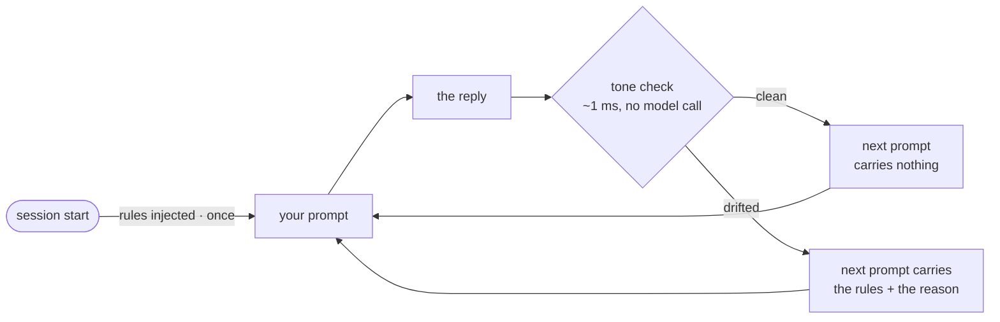

<div align="center">

# plain-speak

### Rules that check themselves.

Terse-response modes for **Claude Code** and **Codex**, with a silent checker that
reads every reply and puts the rules back **only when the model drifts.**

*This README is written in `normal` mode. It should read like the thing it sells.*

[](./LICENSE)
[-2ea8a5)](https://nodejs.org)
[](./package.json)

</div>

---

## Modes

One question, asked three times for real: **"explain to me how redis cache works"**.

> Provenance: Claude Code, model `claude-opus-5`, one fresh single-turn session per mode,
> 25 July 2026, via `claude -p "explain to me how redis cache works" --model claude-opus-5`.
> Opening lines are verbatim; the token counts are that reply's own `output_tokens`. One
> run each, so treat the percentages as an illustration, not a measurement.

### `off` — nothing injected, nothing checked

`1,765 output tokens`

```
Redis is an in-memory key-value store. That's the whole trick: your data lives in RAM
instead of on disk, so a lookup takes microseconds instead of the milliseconds a
database query costs.

## The basic shape

Your app sits between a client and a slow data source (Postgres, an external API, a
heavy computation). Redis sits beside it:
…
```

### `normal` — the base voice

Plain, answer first, full thoughts welcome, zero fuss.

`1,466 output tokens` · **17% shorter**

```
## What it is

Redis keeps data in RAM, not on disk. That's the whole trick. A lookup is a hash-table
hit in memory — microseconds — instead of a database query that touches disk, joins
tables, and takes milliseconds.

You put it *in front of* your slow thing (Postgres, an API, a computed report). It
stores copies of answers you already worked out.
…
```

### `cte` 🧠 — the same voice at twelve

Short. Blunt. Fragments.

`1,195 output tokens` · **32% shorter**

```
**Redis = in-memory key-value store. Cache = you put stuff there before hitting the
slow thing.**

## Why fast
- Data lives in RAM. No disk seek.
- Single-threaded event loop. No lock contention.
- Dumb data model. Get key, return bytes. ~100k ops/sec, sub-millisecond.

## The core loop (cache-aside)
1. App needs user 42.
2. Ask Redis: `GET user:42`.
…
```

Nothing was cut from the answer — all three cover TTLs, eviction, invalidation and the
thundering herd. `cte` says it in a third fewer tokens. One reply each, though: the
measured version is [further down](#does-it-actually-save-tokens).

---

## Injected once, then only when it slips

A rules file only works while the model can see it. The usual fix is to inject it every
prompt, and pay for it every prompt — including the ones where the model behaved.

plain-speak injects once, then watches. Every reply is scored. The score decides whether
the *next* prompt carries the rules.



| | You ask | It answers | Verdict | Next prompt carries |
|---|---|---|---|---|
| 1 | what's on port 3000? | `lsof -i :3000` | clean | nothing |
| 2 | and kill it? | "Certainly! It's worth noting you could leverage…" | **drift** | rules + the reason |
| 3 | thanks | "Anytime." | clean | nothing |
| 4 | why did it bind twice? | *(a long, careful explanation)* | exempt — you asked *why* | nothing |

The check is a scan of the text. No model call, no tokens, and nothing of it appears
in your transcript.

---

## Install

```
/plugin marketplace add rnzsanchez/plain-speak
/plugin install plain-speak@plain-speak
```

Or, to cover Codex as well as Claude Code:

```sh
npx github:rnzsanchez/plain-speak install
```

→ **[All install routes, what gets written, uninstall](./docs/install.md)**

---

## Commands

Everything runs inside a session. Installing is the only thing you do in a shell.

| Command | What it does |
|---|---|
| `/plain-speak:init` | Say which mode is active. Runs nothing — the answer is already in context |
| `/plain-speak:init cte` | Switch mode — `off`, `normal`, `cte`. Re-arms the rules, answers in the new voice |
| `/plain-speak:stats` | Token and drift report: this session, and lifetime |

Plugin commands carry the plugin's namespace, hence the `:`. The npx route has no
namespace, so there they are `/plain-speak`, `/plain-speak cte` and `/plain-speak-stats`.
Installing over a plugin skips them, so no command shows up twice.

The model cannot trigger either one. Only you can. They load at the next session start.

There is a badge for your statusline too, if yours renders plugin badges. `off` hides it.

---

## The checker

It scores **tone, not length.** A long, complete answer is fine; a fussy one is not.
Each hit is a point, and the mode's threshold decides when the points mean drift.

It stands down when the reply was *meant* to be long — you asked for detail, a
walkthrough, a plan or a doc; the reply is mostly code; the turn was a plan.

It will not nag. There is no cap, because a cap that runs out stops correcting a model
that is still drifting. There is a threshold instead. Past it, corrections come four
turns apart and shrink to a one-line nudge — repeated drift usually means the context is
already big, and more context is not the fix.

→ **[Signals, thresholds, exemptions, tuning](./docs/checker.md)**

---

## Stats

An example report — the shape of the output, with made-up counters:

```
plain-speak — cte

  Saved roughly 11,300 tokens. Cost 1,400 to do it.
  Rough: 48% comes from a benchmark on claude-opus-5, not from this session.

This session
  stayed short   █████████░  9 of 11 replies
  had to remind  2 times
  I talked       13,800 tokens
  I worked       104,700 tokens of tool calls and code — untouched by the rules
  last slip      filler: "certainly"; corporate word: "leverage"

Lifetime
  stayed short   █████████░  185 of 203 replies, across 14 sessions
  reminders      12, about 2,200 tokens all in
```

Token counts come from the transcript, so they are real. The saving is not: it is your
model's benchmark cut applied to the **talking only**. Tool calls, code and commits are
written normally in every mode, so they are excluded — in this example they are 88% of
the output. Multiplying the percentage across all of it would overstate the saving about
eightfold. No benchmark for your model, no figure at all.

---

## Does it actually save tokens?

Sometimes. Measured cut in output tokens against `off`, 3-turn sessions, `node
bench/run.mjs` — Claude models through `claude -p`, GPT models through `codex exec`. Opus
is the median of 5 runs; every other row is a single run and moves under repetition. Raw
per-run JSON is in [`bench/results/`](./bench/results):

```
                    normal                      cte
              longer ← 0 → shorter      longer ← 0 → shorter
claude-opus-5          │██████████    48%        │██████        29%
claude-sonnet-5        │███████       36%        │████████████  59%
claude-haiku-4-5       │██            10%        │█              5%
gpt-5.6-sol         ░░░│             −16%        │██            10%
gpt-5.6-terra         ░│              −4%        │█              4%
gpt-5.6-luna        ░░░│             −15%        │               0%
gpt-5.5                │               0%        │█              6%
gpt-5.4               ░│              −5%     ░░░│             −15%
gpt-5.4-mini           │█              7%    ░░░░│             −22%
```

It works on the large Claude models, and only there. On Haiku it barely registers. On GPT
models `normal` made five of six *longer*.

Repetition matters: Opus `cte` first measured 52% on one run and 29% on the median of
five. Assume every single-run row carries that much doubt, and re-run your own model
before believing any of it.

→ **[Method and caveats](./docs/benchmark.md)** · **[Full numbers](./RESULTS.md)**

---

## Before you install

It replaces nothing. A clean machine and one already full of plugins end up the same.

What it costs:

| Cost | Detail |
|---|---|
| Settings edits | The npx route adds three hook entries. The plugin route adds none |
| Time | Two node starts per turn, ~135 ms, nearly all of it interpreter startup |
| Accuracy | The checker is a heuristic. It will sometimes be wrong |
| Savings | Nil or negative on anything but Opus or Sonnet — check your own model first |

→ **[The honest downsides, in full](./docs/tradeoffs.md)**

---

## How it works

| Hook | Job |
|---|---|
| `SessionStart` | Injects the mode's rules — once |
| `UserPromptSubmit` | Injects **nothing**, unless drift was flagged or you switched mode |
| `Stop` | Scores the reply, records the verdict, prints nothing, never blocks |

Codex fires the same three events with the same payloads, so one set of scripts
serves both tools. Zero dependencies — Node, plus one bash script for the badge.

<div align="center">

---

**MIT** · for people who like short answers

</div>
