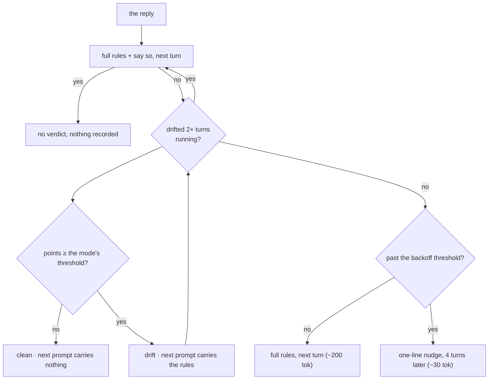

# The checker

Runs on every reply, in the `Stop` hook. No model call, no tokens, no visible output.
Codex receives `{}` because its Stop schema requires valid JSON. It scores the reply,
records a verdict, and stops.

It never blocks the turn. Making the model spend a whole extra turn being told to
be shorter would cost more than the drift did.



## What it scores

Tone and shape, not total reply length. A long, complete answer is fine. A fussy one is not.

Each hit is one point. The mode's threshold decides when the points mean drift, so
a single stray word never trips `normal`.

| Signal | Examples |
|---|---|
| Filler | "Certainly", "Great question", "I hope this helps", "feel free to" |
| Corporate register | leverage, utilize, facilitate, seamless, holistic, paradigm, synergy |
| Fussy phrasing | furthermore, moreover, subsequently, "it is important to note" |
| Robot register | "I have completed the task", "please be advised", "kindly" |
| Walls of prose | paragraphs of 2+ sentences and 25+ words, past the threshold |
| Long sentences | past the threshold |

## Thresholds

| Mode | Points to trip | Sentence words | Walls |
|---|---:|---:|---:|
| `normal` | 3 | 30 | 3 |
| `cte` | 1 | 8 | 1 |

Tables, lists, headings and quotes are the formats the rules ask for. They are not
counted as prose, and their sentence length is not measured.

**Naming a phrase is not using it.** Inline code and quoted lines are removed before
the marker scan, so a reply that says the checker catches `utilize`, or that quotes
someone else's fussy sentence, is not penalised for it.

Only walls count as paragraphs. Counting every prose block made `cte` flag replies
as short as "Done."

## When it stands down

Code-heavy replies and plan mode stand down before any scoring. A request for detail
skips only sentence and prose-wall signals; filler, corporate language and robot
register still count.

| Exemption | Trigger |
|---|---|
| `length-requested` | The prompt asked for detail, so sentence and prose-wall signals are skipped |
| `code-heavy` | More than half the reply is inside fenced code blocks |
| `plan-mode` | The turn ran in plan mode |
| `mode-off` | Mode is `off` |

Only a boolean is carried from the prompt hook to the `Stop` hook. No prompt text
is ever stored.

## When it speaks up

On a trip, the next prompt carries the rules back plus a one-line reason — as
suppressed context, so it reaches the model and not your screen.

There is deliberately **no cap.** A cap that runs out stops correcting a model that is
still drifting, which is the opposite of the point. Instead it crosses a threshold and
eases off:

| | First 3 corrections | After that | Drifting 2+ turns running |
|---|---|---|---|
| Wait between corrections | 1 turn | 4 turns | 1 turn |
| What gets sent | the mode's full rules (~200 tok) | a one-line nudge (~30 tok) | the full rules, and a line saying it has now drifted N turns running |

Easing off is right when the corrections are landing and the drift is occasional. It is
exactly wrong when the model drifts turn after turn: that is evidence the message is too
weak, and answering it with a longer gap and a shorter message makes it worse. So a
**streak** of consecutive drifted turns overrides the backoff and escalates instead. One
clean turn is the only thing that clears the streak — it is the only evidence a
correction actually landed.

`PLAIN_SPEAK_ESCALATE_AFTER` sets how many consecutive drifted turns trigger that,
default 2.

Repeated drift usually means the context has grown large — and answering a big context
with yet more context is the wrong move, so it backs off rather than escalating.

A clean reply means there is nothing to correct, so nothing is sent at all.

```sh
PLAIN_SPEAK_BACKOFF_AFTER=1 claude   # ease off almost immediately
```

## What it costs to run

**No tokens at all** — there is no model call anywhere in it.

In wall clock, measured on an M-series Mac: the `Stop` hook that does the checking
takes 55 ms end to end, and a bare `node -e ''` costs 76 ms on the same machine. The
scan itself is lost inside interpreter startup.

## Where it can be wrong

It is a heuristic on phrasing, so it will occasionally miss a fussy reply and
occasionally flag one that genuinely needed a long sentence. `cte` more than
`normal`, because `cte` trips on a single hit. The cooldown exists so that a false
positive costs you one reinjection, not a run of them.

## Tuning it

The thresholds and word lists are plain data at the top of
[`src/drift.js`](../src/drift.js). Edit, then `npm test` — the unit tests cover
every threshold, every exemption, and the backoff.
