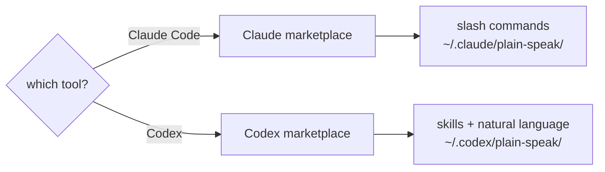

# Install

Pick your tool.



One route per tool: the GitHub plugin marketplace. Install both if you use both — they
keep separate state and neither knows about the other.

## Plugin (Claude Code)

From a shell, no session needed:

```sh
claude plugin marketplace add rnzsanchez/plain-speak
claude plugin install plain-speak@plain-speak
```

Update it the same way:

```sh
claude plugin marketplace update plain-speak && claude plugin update plain-speak@plain-speak
```

The same two steps work inside a session as `/plugin marketplace add …` and
`/plugin install …`, and `/plugin uninstall plain-speak` removes it.

Hooks load on the next session; `/hooks` reloads them straight away. Run
`/plain-speak:init` once afterwards — it puts the badge in your statusline and clears
anything an older install left behind.

## Plugin (Codex)

Install straight from the GitHub marketplace:

```sh
codex plugin marketplace add rnzsanchez/plain-speak
codex plugin add plain-speak@plain-speak
```

Remove the plugin with `codex plugin remove plain-speak@plain-speak`. Remove its
marketplace too with `codex plugin marketplace remove plain-speak`.

Codex skills use `$` or natural language, not custom slash commands:

| Task | Prompt |
|---|---|
| Show mode | `$plain-speak:init` or `which plain speak mode is active?` |
| Switch mode | `plain speak cte` |
| Stats | `$plain-speak:stats` |

Exact mode pattern: `plain speak off|normal|cte`. Replace the final part with one mode.
Codex keeps its mode and stats under `~/.codex/plain-speak/`.
## Choosing a mode per project

Global state stays separate:

| Tool | Mode and stats |
|---|---|
| Claude Code | `~/.claude/plain-speak/` |
| Codex | `~/.codex/plain-speak/` |

Changing Codex mode does not change Claude Code mode.

| Precedence | Claude Code | Codex |
|---|---|---|
| 1 | `PLAIN_SPEAK_MODE=cte` | `PLAIN_SPEAK_MODE=cte` |
| 2 | `.plain-speak-mode` | `.plain-speak-codex-mode` |
| 3 | `~/.claude/plain-speak/mode` | `~/.codex/plain-speak/mode` |

On Claude Code, pin a project with `/plain-speak:init cte --project`. For Codex, write
the mode to `.plain-speak-codex-mode`. Commit either file to share the choice, or add it
to `.gitignore` to keep it yours.

## Where things live

| Path | What |
|---|---|
| `~/.claude/plain-speak/` | Claude runtime copy, mode file, `state.json` |
| `~/.codex/plain-speak/` | Codex runtime copy, mode file, `state.json` |
| `~/.claude/settings.json` | The badge, and nothing else |
| `~/.codex/config.toml` | `[features] hooks = true`, if it was not already set |

The hooks themselves are declared by the plugin, so neither tool's settings file
carries them. Each tool keeps its own runtime copy at a fixed path: a plugin's own
directory has its version in the path, so anything pointing there would break on the
next update.

## The badge

The badge shows the active mode, and is on whenever plain-speak is. Switching to `off`
hides it, since there is nothing to report. Claude Code only — Codex builds its own
status line and takes no command to render one.

Running the mode command puts the badge in for you:

| Your setup | What it does |
|---|---|
| No statusline | the badge becomes your statusline |
| A statusline of your own | the badge goes in front, yours keeps running behind it |
| A statusline that renders plugin badges | nothing — it already draws this one |

That last case is detected by reading the scripts your statusline runs and looking for
the `*-statusline.sh` glob plugin badges are found by. Chained, it looks like this:

```json
"statusLine": { "command": "bash ~/.claude/plain-speak/src/plain-speak-statusline.sh; bash ~/mine.sh" }
```

It is idempotent. Running the command again changes nothing and says nothing. To place
the badge yourself instead, remove that first segment and call the script from wherever
your own statusline wants it.

## Codex and hook trust

Codex asks you to trust hook sources the first time they run. Accept once. Nothing here
passes `--dangerously-bypass-hook-trust` for you — that prompt is a real check and it is
yours to answer. Until you accept, the hooks are skipped silently.

## Leaving, and moving off an older install

Versions before 2.14.0 shipped an `npx` installer that wrote hooks into
`~/.claude/settings.json` and `~/.codex/hooks.json`. The plugin declares those same
three hooks, so a machine carrying both injects the rules twice.

You do not have to do anything about it. The mode command clears the old wiring the
first time it runs, for the tool it is running under, and says what it removed.

To remove plain-speak altogether:

```sh
npx github:rnzsanchez/plain-speak uninstall            # both tools
npx github:rnzsanchez/plain-speak uninstall --claude   # leave Codex working
npx github:rnzsanchez/plain-speak uninstall --codex
npx github:rnzsanchez/plain-speak uninstall --purge    # and delete the mode and stats
```

That takes out the badge, any leftover hooks and skills, and that tool's runtime. The
other tool keeps working. Without `--purge`, each tool's mode and `state.json` stay, so
installing again keeps its history. Uninstalling does not remove the plugin — use
`claude plugin uninstall plain-speak` or `codex plugin remove plain-speak@plain-speak`.
