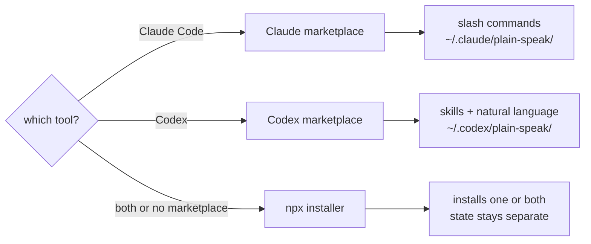

# Install

Pick your tool.



## Plugin (Claude Code)

The cleanest option: no edits to your `settings.json` at all, and the badge is
picked up automatically by any statusline that renders plugin badges.

```
/plugin marketplace add rnzsanchez/plain-speak
/plugin install plain-speak@plain-speak
```

Remove it the same way: `/plugin uninstall plain-speak`. The same thing works from a
shell, which is handy for updates:

```sh
claude plugin marketplace add rnzsanchez/plain-speak
claude plugin install plain-speak@plain-speak
claude plugin marketplace update plain-speak && claude plugin update plain-speak@plain-speak
```

This is the route that gets the badge into a statusline automatically: statuslines
that render plugin badges look for a `*-statusline.sh` under each installed plugin,
and plain-speak ships one.

## Plugin (Codex)

Install straight from the GitHub marketplace:

```sh
codex plugin marketplace add rnzsanchez/plain-speak
codex plugin add plain-speak@plain-speak
```

Remove the plugin with `codex plugin remove plain-speak@plain-speak`. Remove its
marketplace too with `codex plugin marketplace remove plain-speak`.

Codex skills use `$` or natural language, not custom slash commands:

| Task | Prompt |
|---|---|
| Show mode | `$plain-speak:init` or `which plain speak mode is active?` |
| Switch mode | `plain speak cte` |
| Stats | `$plain-speak:stats` |

Exact mode pattern: `plain speak off|normal|cte`. Replace the final part with one mode.
Codex keeps its mode and stats under `~/.codex/plain-speak/`.

## npx (Claude Code and Codex)

Use this when you want one installer for both tools, or do not want the marketplace
route.

```sh
npx github:rnzsanchez/plain-speak install
```

```sh
npx github:rnzsanchez/plain-speak install --claude       # one tool only
npx github:rnzsanchez/plain-speak install --codex
npx github:rnzsanchez/plain-speak install --statusline   # also chain the badge on
npx github:rnzsanchez/plain-speak uninstall
```

Hooks load on the next session. In Claude Code, `/hooks` reloads them immediately.

## From a clone

```sh
git clone git@github.com:rnzsanchez/plain-speak.git
cd plain-speak
node bin/cli.js install
```

## Commands differ by tool

Claude Code namespaces every command a plugin provides, so a plugin-only install cannot
give you a bare `/plain-speak`. The npx installer places user-level commands, which can.

| Tool | Marketplace plugin | npx |
|---|---|---|
| Claude Code mode | `/plain-speak:init cte` | `/plain-speak cte` |
| Claude Code stats | `/plain-speak:stats` | `/plain-speak-stats` |
| Codex mode | `plain speak cte` | `plain speak cte` |
| Codex stats | `$plain-speak:stats` | `$plain-speak-stats` |

Codex has built-in slash commands, but plugins do not add custom ones. Use `$` to invoke
a skill directly, or ask in natural language.

On Claude Code, you never get both command sets. If the plugin is enabled in
`~/.claude/settings.json`, the npx installer wires the hooks and leaves commands to the
plugin. This avoids duplicates in the picker.

## What the npx installer writes

| Path | What |
|---|---|
| `~/.claude/plain-speak/` | Runtime copy, mode file, `state.json` |
| `~/.claude/settings.json` | Three hook entries, added alongside whatever is already there. Backed up to `.plain-speak-backup` first |
| `~/.claude/skills/plain-speak*/` | The two slash commands — skipped when the plugin is enabled |
| `~/.codex/plain-speak/` | Codex runtime copy, mode file, `state.json` |
| `~/.codex/hooks.json` | The same three hooks |
| `~/.codex/config.toml` | `[features] hooks = true`, if not already set |
| `~/.codex/skills/plain-speak*/` | The two Codex skills |

Nothing unrelated is replaced or removed. Reinstalling refreshes plain-speak's own
runtime and skills without duplicating hooks.

The runtime copy is not optional: `npx` runs from a temp cache that can be pruned
at any time, so hooks cannot point at it. Claude Code and Codex get separate copies.

## Choosing a mode per project

Global state stays separate:

| Tool | Mode and stats |
|---|---|
| Claude Code | `~/.claude/plain-speak/` |
| Codex | `~/.codex/plain-speak/` |

Changing Codex mode does not change Claude Code mode.

| Precedence | Claude Code | Codex |
|---|---|---|
| 1 | `PLAIN_SPEAK_MODE=cte` | `PLAIN_SPEAK_MODE=cte` |
| 2 | `.plain-speak-mode` | `.plain-speak-codex-mode` |
| 3 | `~/.claude/plain-speak/mode` | `~/.codex/plain-speak/mode` |

On Claude Code, pin a project with `/plain-speak:init cte --project`. For Codex, write
the mode to `.plain-speak-codex-mode`. Commit either file to share the choice, or add it
to `.gitignore` to keep it yours.

## The badge

The badge shows the active mode and is on whenever plain-speak is. Switching to `off`
hides it, since there is nothing to report.

The installer **does not touch a statusline you already have.** Put the badge where
your own statusline wants it, or pass `--statusline` to have it prepended:

```sh
bash ~/.claude/plain-speak/src/plain-speak-statusline.sh
```

If you install as a plugin instead, statuslines that scan installed plugins for a
`*-statusline.sh` will find it on their own.

## Codex and hook trust

Codex asks you to trust hook sources the first time they run. Accept once. The
installer does not pass `--dangerously-bypass-hook-trust` for you — that prompt is
a real check and it is yours to answer.

## Uninstall

```sh
npx github:rnzsanchez/plain-speak uninstall            # both tools
npx github:rnzsanchez/plain-speak uninstall --claude   # leave Codex working
npx github:rnzsanchez/plain-speak uninstall --codex
npx github:rnzsanchez/plain-speak uninstall --purge    # and delete the mode and stats
```

Removes hooks, skills, badge wiring and that tool's runtime. The other tool keeps
working. Without `--purge`, each tool's mode and `state.json` remain so a reinstall
keeps its history.

**Running both routes for one tool double-injects.** If its marketplace plugin is
installed, remove that tool's npx hooks with `uninstall --claude` or
`uninstall --codex`. Its mode and `state.json` stay behind. Use `--purge` to remove
them too.
