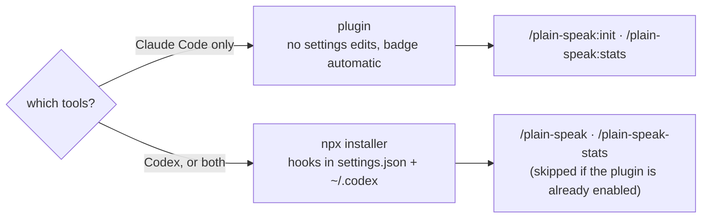

# Install

Three ways in. Pick one.



## Plugin (Claude Code)

The cleanest option: no edits to your `settings.json` at all, and the badge is
picked up automatically by any statusline that renders plugin badges.

```
/plugin marketplace add rnzsanchez/plain-speak
/plugin install plain-speak@plain-speak
```

Remove it the same way: `/plugin uninstall plain-speak`. The same thing works from a
shell, which is handy for updates:

```sh
claude plugin marketplace add rnzsanchez/plain-speak
claude plugin install plain-speak@plain-speak
claude plugin marketplace update plain-speak && claude plugin update plain-speak@plain-speak
```

This is the route that gets the badge into a statusline automatically: statuslines
that render plugin badges look for a `*-statusline.sh` under each installed plugin,
and plain-speak ships one.

## npx (Claude Code and Codex)

Works for both tools, and it is the only route that can wire up Codex.

```sh
npx github:rnzsanchez/plain-speak install
```

```sh
npx github:rnzsanchez/plain-speak install --claude       # one tool only
npx github:rnzsanchez/plain-speak install --codex
npx github:rnzsanchez/plain-speak install --statusline   # also chain the badge on
npx github:rnzsanchez/plain-speak uninstall
```

Hooks load on the next session, or after `/hooks`.

## From a clone

```sh
git clone git@github.com:rnzsanchez/plain-speak.git
cd plain-speak
node bin/cli.js install
```

## Command names differ by route

Claude Code namespaces every command a plugin provides, so a plugin-only install cannot
give you a bare `/plain-speak`. The npx installer places user-level commands, which can.

| | Plugin | npx |
|---|---|---|
| Switch mode | `/plain-speak:init cte` | `/plain-speak cte` |
| Stats | `/plain-speak:stats` | `/plain-speak-stats` |

You never get both. If the plugin is enabled in `~/.claude/settings.json`, the npx
installer wires the hooks and leaves the commands to the plugin — two copies of the same
two commands is only clutter in the picker.

Inside the package the skills are named `mode` and `stats`, and they are prefixed to
`plain-speak` and `plain-speak-stats` when copied to user level — bare `/mode` and
`/stats` would be rude to everything else on your machine.

## What the npx installer writes

| Path | What |
|---|---|
| `~/.claude/plain-speak/` | Runtime copy, mode file, `state.json` |
| `~/.claude/settings.json` | Three hook entries, added alongside whatever is already there. Backed up to `.plain-speak-backup` first |
| `~/.claude/skills/plain-speak*/` | The two slash commands — skipped when the plugin is enabled |
| `~/.codex/hooks.json` | The same three hooks |
| `~/.codex/config.toml` | `[features] hooks = true`, if not already set |
| `~/.codex/skills/plain-speak*/` | The two slash commands |

Nothing existing is replaced or removed. Reinstalling is safe and does not duplicate
hooks.

The runtime copy is not optional: `npx` runs from a temp cache that can be pruned
at any time, so the hooks cannot point at it.

## Choosing a mode per project

The global mode lives in `~/.claude/plain-speak/mode`. Two things override it:

| Precedence | Where |
|---|---|
| 1 | `PLAIN_SPEAK_MODE=cte` — one shell only |
| 2 | `.plain-speak-mode` in the working directory — one project only |
| 3 | the global setting |

Pin a project from inside a session with `/plain-speak:init cte --project`, or write the
file yourself. `/plain-speak:init` reports which of the three is in force, so a pin is
never a mystery. Commit the file to share the choice, or add it to `.gitignore` to keep
it yours.

## The badge

The badge shows the active mode and is on whenever plain-speak is. Switching to `off`
hides it, since there is nothing to report.

The installer **does not touch a statusline you already have.** Put the badge where
your own statusline wants it, or pass `--statusline` to have it prepended:

```sh
bash ~/.claude/plain-speak/src/plain-speak-statusline.sh
```

If you install as a plugin instead, statuslines that scan installed plugins for a
`*-statusline.sh` will find it on their own.

## Codex and hook trust

Codex asks you to trust hook sources the first time they run. Accept once. The
installer does not pass `--dangerously-bypass-hook-trust` for you — that prompt is
a real check and it is yours to answer.

## Uninstall

```sh
npx github:rnzsanchez/plain-speak uninstall            # both tools
npx github:rnzsanchez/plain-speak uninstall --claude   # leave Codex working
npx github:rnzsanchez/plain-speak uninstall --codex
npx github:rnzsanchez/plain-speak uninstall --purge    # and delete the mode and stats
```

Removes the hooks, the commands, the badge wiring and the runtime. Removing one tool
keeps the shared runtime in place, so the other tool keeps working. Without `--purge`
your mode and `state.json` are left behind on purpose, so a reinstall keeps your
history.

**Running both routes at once double-injects.** If you install the plugin and you
already ran the npx installer for Claude Code, drop the npx side with
`uninstall --claude`. Your mode and
`state.json` stay behind; delete `~/.claude/plain-speak/` to be rid of them.
